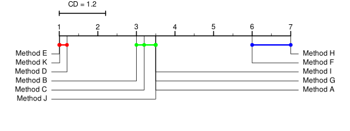
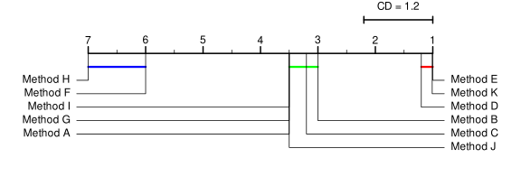
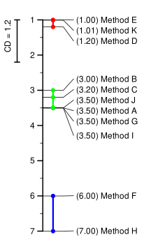
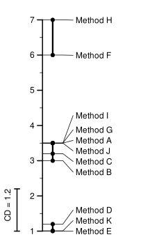

# NemenyiPlot

### Description
`NemenyiPlot` is an R library that allows visualizing the results of Nemenyi tests through customized plots.

### Installation
From the GitHub repository:

```r
remotes::install_github("Ismael-rp/NemenyiPlot")
```

### Usage

Create the data

```r
library(NemenyiPlot)

cd = 1.2

means = c(1, 1.01, 1.2, 3, 3.2, 3.5, 3.5, 3.5, 3.5, 6, 7)

labels = c(
  "Method E", "Method K", "Method D", "Method B", "Method C", "Method J",
  "Method A", "Method G", "Method I", "Method F", "Method H"
)
```

Plots
```r
# Default
NemenyiPlot::plot_nemenyi(means, labels, cd)
```


```r
# Inverted ruler and no dots
NemenyiPlot::plot_nemenyi(means, labels, cd, reversed_ruler = TRUE, dots_size = 0)
```



```r
# Vertical with means in labels
NemenyiPlot::plot_nemenyi(means, labels, cd, vertical = T, show_means = TRUE)
```




```r
# Vertical, inverted ruler with no colored ties
NemenyiPlot::plot_nemenyi(
  means, labels, cd, vertical = T, reversed_ruler = TRUE, color_ties = FALSE)
```




### Nemenyi + Plot


-   `nemenyi_test_and_plot` calculates the Nemenyi test and plots the results. Expects a matrix where **each row is a sample** and **each column is a method**.

```r
set.seed(1)

x = matrix(rnorm(50 * 6, mean = 0, sd = 1), 50, 6)

x[,1] = x[,1] + 1
x[,2] = x[,2] + 2
x[,3] = x[,3] + 3
x[,4] = x[,4] + 4
x[,5] = x[,5] + 100
x[,6] = x[,5] + 100

colnames(x) = c("Method A", "Method B", "Method C", "Method D", "Method E", "Method F")

NemenyiPlot::nemenyi_test_and_plot(x, conf.level = 0.95)
```

-   `nemenyi_test_and_plot_as_rows` takes a **long-format data frame** with columns for scores, methods, and groupings.

```r
set.seed(1)

methods = c("Method A", "Method B", "Method C", "Method D", "Method E", "Method F")

df = expand.grid(
  group = 1:10,
  method = methods
)

df$score = c(
  rnorm(10, mean = 0, sd = 1),
  rnorm(10, mean = 1, sd = 1),
  rnorm(10, mean = 2, sd = 1),
  rnorm(10, mean = 3, sd = 1),
  rnorm(10, mean = 100, sd = 1),
  rnorm(10, mean = 200, sd = 1)
)

NemenyiPlot::nemenyi_test_and_plot_as_rows(
  df, score = "score", method = "method", group = "group")
```


